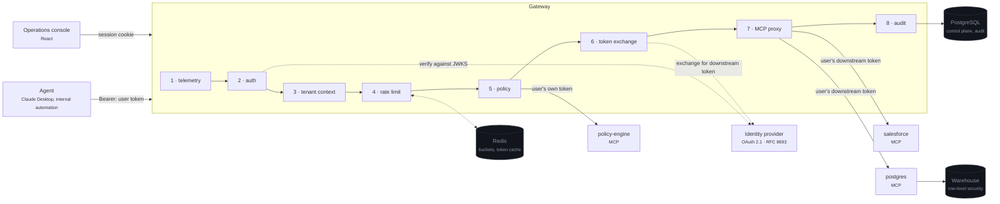
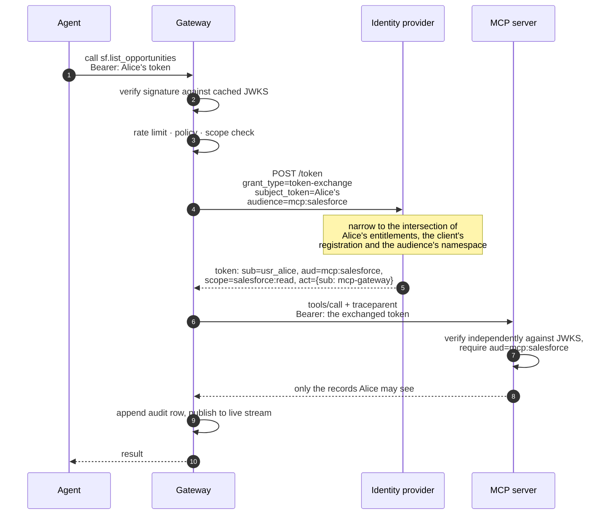

# mcpgateway

**An enterprise gateway for the Model Context Protocol.** Every tool call your agents make
carries the identity of the person who made it — not a shared service account — and arrives with
rate limits, policy, a tamper-evident audit trail and a distributed trace already applied.

[](https://github.com/USER/mcpgateway/actions/workflows/ci.yml)


```bash
git clone https://github.com/USER/mcpgateway && cd mcpgateway
make demo          # console on :3000, traces on :16686, dashboards on :3001
```

---

## The problem

Most MCP deployments today hand the agent a service-account token. It is the fastest thing that
works: one credential, configured once, and every tool call succeeds.

It also quietly removes authorisation from the system. That token holds the union of every
permission any user might need, so the moment an agent acts on behalf of a person, that person is
operating with the combined privileges of everyone. An analyst asks a question about their own
accounts and the CRM answers with the whole company's. Nothing has been breached and no rule has
been broken — the agent simply had more authority than the human it was serving, and nothing in the
system was in a position to notice.

The usual patch is to filter in the application: the agent knows who is asking, so it adds a `WHERE`
clause. That works exactly as long as every code path remembers to. It is not a boundary; it is a
convention, and conventions are not what you want between an LLM and a customer database.

**mcpgateway moves the boundary back to where it can be enforced.** The gateway exchanges the
caller's own OAuth token for a downstream token scoped to that user, addressed to one specific MCP
server, valid for minutes. The downstream service then authorises the human, using the same identity
system it would if the human had called it directly. A tool call from Alice can only reach what
Alice could reach, because the credential it carries is Alice's. Around that sits the plumbing any
real deployment needs and nobody enjoys writing: atomic rate limits, an append-only audit log you
can actually verify, policy evaluation, and end-to-end tracing.

---

## Architecture



Full detail, including the C4 breakdown and the threat model, is in
[docs/ARCHITECTURE.md](docs/ARCHITECTURE.md).

---

## What it does

|     | Capability               |                                                                                                                                                                                    |
| --- | ------------------------ | ---------------------------------------------------------------------------------------------------------------------------------------------------------------------------------- |
| 🔑  | **Permission mirroring** | RFC 8693 token exchange on every call. The downstream token names the caller, is addressed to one service, and expires in minutes. No service-account fallback exists in the code. |
| ⚡  | **Atomic rate limiting** | Token buckets as a single Lua script, so read–refill–decide–write is indivisible. Exact under concurrency across every replica. Hot-reloaded over Redis pub/sub.                   |
| 📜  | **Tamper-evident audit** | Append-only, hash-chained per tenant, written by a role holding `INSERT` and nothing else. The verifier recomputes from genesis and names the first broken row.                    |
| 🛡️  | **Policy decisions**     | A compact rule evaluator over checked-in YAML. Default deny. Rules cover argument content, plan, scope, role and rate-tier override.                                               |
| 🔍  | **End-to-end tracing**   | One trace per request across gateway → policy → target server → downstream, with `trace_id` on every log line.                                                                     |
| 🏢  | **Multi-tenancy**        | Tenant comes from the token, never a parameter. Row-level security in the warehouse enforces it in the database, not the application.                                              |
| 🖥️  | **Operations console**   | Live request stream, filterable audit log with one-click chain verification, editable rate limits, policy explorer.                                                                |
| 🔌  | **Streamable HTTP**      | The current MCP transport, stateless, so servers scale horizontally without sticky sessions.                                                                                       |

---

## Quickstart

**Requirements:** Docker, Node.js 20+, and pnpm (installed automatically if missing).

```bash
make demo
```

That builds the images, starts everything, migrates, loads data — three tenants, twelve users, a
50,000-row warehouse and a week of audit history — and prints the URLs.

|                      |                                             |
| -------------------- | ------------------------------------------- |
| Console              | <http://localhost:3000>                     |
| Gateway API          | <http://localhost:8080>                     |
| Identity provider    | <http://localhost:9000>                     |
| Traces (Jaeger)      | <http://localhost:16686>                    |
| Dashboards (Grafana) | <http://localhost:3001> — `admin` / `admin` |
| Metrics (Prometheus) | <http://localhost:9090>                     |

Sign in with any seeded account; the password is `Passw0rd!` for all of them.

| Account                      | Role                     | Sees                     |
| ---------------------------- | ------------------------ | ------------------------ |
| `alice.chen@acme-corp.com`   | analyst, West            | the records she owns     |
| `bob.martinez@acme-corp.com` | manager, West            | the whole West territory |
| `dana.olsen@acme-corp.com`   | admin                    | the whole tenant         |
| `liam.novak@initech.dev`     | analyst, restricted plan | hits policy denials      |

> If a port is already taken on your machine, put an override in `.env`
> (`POSTGRES_PORT=5433`, `REDIS_PORT=6380`, …) and re-run. Only the published host ports change.

**Other commands**

```bash
make check          # typecheck, lint, unit tests
make test-integration   # Testcontainers: real Postgres and Redis
pnpm oauth:walkthrough  # the token exchange, step by step, with decoded tokens
pnpm verify:audit       # walk every chain
pnpm bench              # measure this machine
```

`docs/DEMO.md` is a ten-minute walkthrough that ties these together.

---

## How permission mirroring works



Three properties do the work:

**The subject never changes.** The exchanged token still says `sub: usr_alice`. The CRM server
authorises Alice, and the gateway is recorded in the `act` claim as the party that performed the
exchange — "Alice, acting through the gateway", which is exactly what happened.

**Scopes can only narrow.** The granted set is the intersection of what the subject is entitled to,
what the client is registered to request, and what the target audience is permitted to receive.
Widening is not expressible. Ask for a scope the subject does not hold and the exchange is refused,
not silently downgraded.

**It fails closed.** If the exchange fails, the request fails with a `PermissionMirrorError` and the
refusal is audited. There is no fallback path, which is the one line of code that would undo the
entire design.

You can watch all of it: `pnpm oauth:walkthrough` runs the real flow and prints the decoded tokens
at each step, including a deliberate attempt to widen scope so you can see it refused.

The observable consequence: Alice and Bob call the same tool with the same arguments and get **26**
and **52** opportunities back respectively, because their tokens differ. Under a service account
both would see all 100. Details in [docs/PERMISSION_MIRRORING.md](docs/PERMISSION_MIRRORING.md).

---

## How the rate limiter works

The whole limiter is one Lua script, evaluated inside Redis:

```lua
local state  = redis.call('HMGET', key, 'tokens', 'ts')
local tokens = tonumber(state[1])
local ts     = tonumber(state[2])

if tokens == nil or ts == nil then
  tokens = capacity        -- first sighting: start full
  ts     = now
end

local elapsed_ms = now - ts
if elapsed_ms < 0 then elapsed_ms = 0 end   -- a clock jump must not mint tokens

if refill_interval_ms > 0 and refill_tokens > 0 then
  -- continuous refill: fractional tokens carry over, so 60/minute admits one
  -- call per second rather than 60 at the top of each minute
  tokens = tokens + ((elapsed_ms / refill_interval_ms) * refill_tokens)
end
if tokens > capacity then tokens = capacity end

local allowed, retry_after_ms = 0, 0
if tokens >= cost then
  allowed = 1
  tokens  = tokens - cost
else
  retry_after_ms = math.ceil(((cost - tokens) / refill_tokens) * refill_interval_ms)
end

redis.call('HSET', key, 'tokens', tokens, 'ts', now)
redis.call('PEXPIRE', key, ttl_ms)
return { allowed, math.floor(tokens), retry_after_ms, capacity }
```

The reason it is Lua and not three commands: `GET` / compute / `SET` from the application is a
textbook race. Two gateway replicas read the same bucket, both conclude there is room, and both
admit the request. Under load that overshoots by roughly the number of replicas — precisely when the
limit matters. Inside a script it is one indivisible step, and one round trip instead of three.

The integration suite fires **500 concurrent requests at a bucket of 100 and asserts exactly 100 are
admitted**, then does it again across four independent Redis clients standing in for four replicas.
Full source: [`packages/rate-limit/token-bucket.lua`](packages/rate-limit/token-bucket.lua). More in
[docs/RATE_LIMITING.md](docs/RATE_LIMITING.md).

---

## How the audit chain works

Each row commits to the row before it:

```
row_hash = sha256( prev_hash || canonical_json(row without its hash columns) )
```

Change any historical field and that row's hash changes, which breaks the `prev_hash` link every
later row depends on. Rewriting one row means rewriting the entire tail, and the verifier reports
the exact row where recomputation first diverges.

Three things make it more than a nice property:

- **Canonical JSON.** Two structurally identical rows must serialise byte-identically, or
  verification would fail on rows nobody touched. Keys are sorted, `undefined` is omitted,
  `-0` is normalised, non-finite numbers are rejected.
- **Append-only privileges.** The gateway connects as a role holding `INSERT` plus a column-level
  `SELECT` on `seq` (which `RETURNING` requires) and nothing else. A guard trigger catches the
  owner-level case that grants cannot. `UPDATE`, `DELETE` and `TRUNCATE` all fail at the database.
- **Per-tenant chains.** A single global chain would funnel every audit write through one lock.
  Per-tenant chains let tenants append concurrently while keeping tamper-evidence inside the
  boundary an auditor cares about, and the genesis hash is derived from the tenant id so a row
  cannot be spliced between chains.

See it work:

```bash
pnpm verify:audit                    # walk every chain
pnpm verify:audit --corrupt-row 42   # alter one row, catch it, restore
```

```
  Target   row seq 42 (bbf72ca8-…) in tenant globex
  Before   VALID (1369 rows)

  Altering the row. This first has to disable the guard trigger, which
  requires ownership of the table — the gateway's own role cannot do it.

  After    BROKEN
      first break at seq 42
      reason   row_hash_mismatch
      expected 4edf446e59ff54b2…
      actual   20f57f37cff0d314…

  One field changed by one millisecond, and the chain no longer verifies.
```

More in [docs/AUDIT_LOG.md](docs/AUDIT_LOG.md).

---

## Benchmarks

**This repository contains no benchmark numbers, because none have been measured on your machine.**

`scripts/load-test.ts` drives real tool calls through the running gateway — the whole enforcement
path, not a microbenchmark — and reports the distribution it actually achieved:

```bash
pnpm bench                                          # 30s, 50 connections
pnpm bench -- --duration 60 --connections 100       # heavier
pnpm bench -- --json --out docs/benchmark.json      # machine-readable
```

It discards a warm-up window (JIT, connection setup, the first uncached token exchange, a cold JWKS
fetch), computes percentiles from every sample rather than an estimate, and warns you if most
requests were rate limited — in which case the latency figures describe refusals rather than work.

Record what you get in [docs/BENCHMARKS.md](docs/BENCHMARKS.md), which has a template and asks for
the hardware alongside the numbers.

---

## What's real and what stands in

Every substitution is labelled `// MOCK:` in the source and listed here. Nothing is hidden;
`grep -rn "MOCK:" .` finds all of it.

| Component                           | Status         | Notes                                                                                                                                                  |
| ----------------------------------- | -------------- | ------------------------------------------------------------------------------------------------------------------------------------------------------ |
| OAuth 2.1 + PKCE, RFC 8693 exchange | **Real**       | Real signatures, real JWKS, real scope narrowing. The protocol is the production one.                                                                  |
| Identity provider                   | **Stands in**  | `apps/mock-idp` is a real OIDC provider over a local user directory. Point `OIDC_ISSUER` at Okta, Entra or Auth0 and the gateway needs no code change. |
| Redis token bucket                  | **Real**       | Real Lua on real Redis. Concurrency asserted in tests.                                                                                                 |
| Audit chain and privileges          | **Real**       | Real SHA-256 chain, real Postgres grants, real guard trigger.                                                                                          |
| Warehouse MCP server                | **Real**       | Real PostgreSQL, real row-level security, real `SET LOCAL ROLE` per request.                                                                           |
| Warehouse data                      | **Generated**  | ~50k orders from a fixed seed with weekly and quarter-end seasonality.                                                                                 |
| CRM MCP server                      | **Stands in**  | `// MOCK: Salesforce` — in-memory records behind the tool surface a real CRM server would present. The visibility rules are not simplified.            |
| CRM data                            | **Generated**  | 100 accounts, 500 contacts, 200 opportunities from a fixed seed.                                                                                       |
| Policy engine                       | **Simplified** | A compact evaluator rather than a real OPA sidecar. Rego is the right answer in production; the rejected-alternatives section says why.                |
| Tracing, metrics, logs              | **Real**       | Real OpenTelemetry to a real collector, Jaeger, Prometheus, Loki and Grafana.                                                                          |

---

## Repository layout

```
apps/
  gateway/              enforcement pipeline, console API, BFF
  dashboard/            operations console (React)
  mock-idp/             OAuth 2.1 provider with RFC 8693
  mcp-servers/
    salesforce/         CRM tools, scope-derived record visibility
    postgres/           warehouse tools, row-level security
    policy-engine/      rule evaluator over YAML bundles
packages/
  shared/               errors, canonical JSON, config, Drizzle schema
  auth/                 JWKS cache, verification, OAuth client, token exchange
  telemetry/            OTel bootstrap, pino, trace helpers, metrics
  audit/                hash chain, writer, verifier, read API
  rate-limit/           Lua script, wrapper, config store
  mcp-runtime/          shared MCP server scaffolding and client
infra/                  compose stack, migrations, Grafana, collector config
scripts/                seed, reset, migrate, verify chain, walkthrough, load test
docs/                   architecture, security, and one document per pillar
```

---

## Roadmap

Honest about what a production deployment would need next:

- **Real OPA.** Swap the built-in evaluator for a sidecar and Rego bundles.
- **Audit throughput.** Chains are per tenant; a very large tenant would want sharded chains or a
  Merkle tree with periodic anchoring.
- **Cross-replica live view.** The console's stream is per-process. A Redis stream would fix it;
  the audit table already covers durability.
- **Token exchange without a round trip.** Cache warming or provider-side batch exchange for the
  cold-start path.
- **Fastify 5.** Pinned to 4 to match the stated stack; the upgrade is contained.
- **Dashboard test depth.** One Playwright smoke test today; the console deserves more.

## License

MIT. See [LICENSE](LICENSE).
