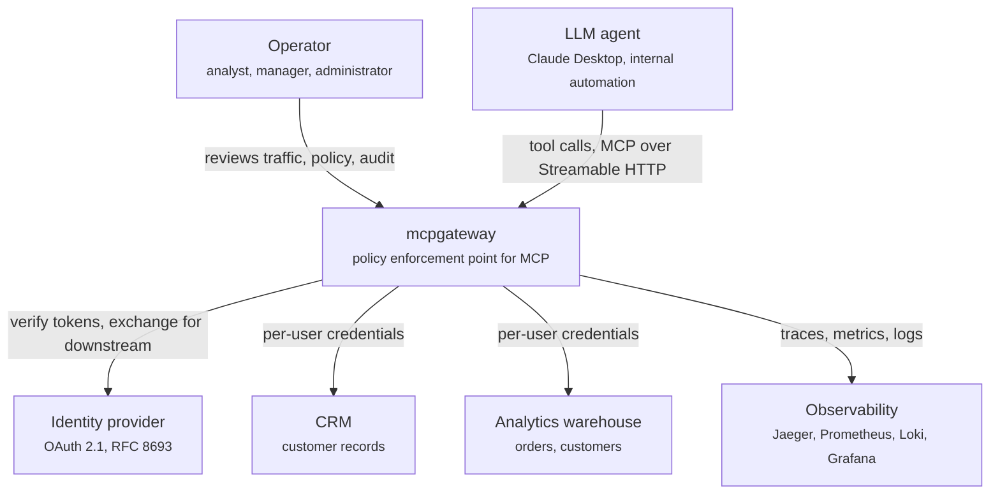
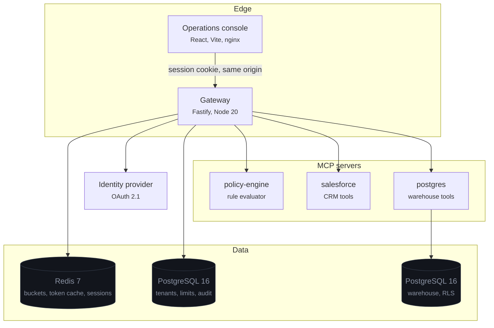
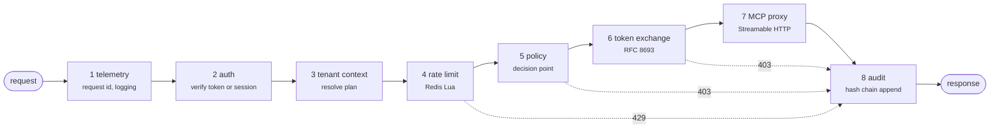

# Architecture

## Context



The system sits between agents and the services they act on. It is the only component that holds
both the caller's identity and the downstream credential, which is what lets it be the place
authorisation happens.

## Containers



Two Postgres databases, deliberately. The warehouse holds customer data the control plane has no
business being able to read, and separating them makes that structural rather than aspirational.

The gateway opens **two connection pools** against the control plane: one on a full-access role, one
on a role that can only append to `audit_events`. Sharing a connection would collapse the
distinction the split exists to create.

## Components — the gateway



The order is load-bearing, and each position is a decision:

**Rate limiting before policy.** A caller flooding the gateway is turned away for the cost of one
Redis round trip, rather than a policy call plus a token exchange plus an upstream request.

**Policy before token exchange.** No credential is minted for a call that is going to be refused.
Minting first would mean a refused request still leaves a usable downstream token in the cache.

**Audit reachable from every refusal.** Stages 4–6 are `preHandler` hooks, so a refusal
short-circuits the handler. The route registers its own error handler that appends the audit row
before returning, which is why an `audited` flag exists on the invocation — the row must be written
exactly once whether the request succeeded or was refused.

**Tenant context before anything that branches on plan.** Policy rules and rate tiers key off the
plan, and it comes from the database keyed by the token's `tenant_id` claim — never from a path
parameter or header.

## Data flow, one request

```mermaid
sequenceDiagram
  autonumber
  participant A as Agent
  participant G as Gateway
  participant R as Redis
  participant I as Identity provider
  participant P as policy-engine
  participant S as salesforce
  participant D as PostgreSQL

  A->>G: POST /v1/servers/salesforce/tools/sf.query
  G->>I: JWKS (cached; refetched only on an unknown kid)
  G->>G: verify signature, build Principal from claims
  G->>D: resolve tenant (cached 30s)
  G->>R: EVALSHA token bucket — user, then tenant
  R-->>G: allowed, remaining, retry_after

  G->>I: exchange → aud=mcp:policy-engine
  G->>P: policy.evaluate (caller's own token)
  P-->>G: allow, rule=allow-known-tools, tier=burst

  G->>I: exchange → aud=mcp:salesforce
  Note over I: scopes narrowed to the salesforce namespace
  I-->>G: token, sub unchanged, act=mcp-gateway
  G->>R: cache under sub:audience:scope_digest

  G->>S: tools/call + traceparent
  S->>I: JWKS, verify, require aud=mcp:salesforce
  S-->>G: records visible to this subject

  G->>D: append audit row (INSERT-only role, chain head locked)
  G-->>A: result + meta (policy, exchange, rate limit)
```

Everything after step 3 derives from claims in a signature-verified token. There is no point in the
flow where a client-supplied value determines who the caller is or what they may reach.

## Threat model

STRIDE, against the assets this system actually holds.

| Threat                     | Scenario                                                       | Defence                                                                                                                                        | Where                                        |
| -------------------------- | -------------------------------------------------------------- | ---------------------------------------------------------------------------------------------------------------------------------------------- | -------------------------------------------- |
| **Spoofing**               | A caller forges a token to act as another user                 | RS256 signature verified against the provider's JWKS with an explicit algorithm allow-list; `alg: none` and HMAC confusion are refused         | `packages/auth/src/verify.ts`                |
| **Spoofing**               | A token minted for one MCP server is replayed against another  | Every server requires its own `aud`; the exchange addresses one audience                                                                       | `packages/mcp-runtime/src/server.ts`         |
| **Spoofing**               | A stolen downstream token is reused later                      | Exchanged tokens live minutes, cached at most `TOKEN_EXCHANGE_CACHE_MAX_TTL_SECONDS` and never past their own expiry                           | `packages/auth/src/token-exchange.ts`        |
| **Tampering**              | Someone edits an audit row to hide a call                      | Per-tenant hash chain; the writer's role has no `UPDATE`/`DELETE`; a guard trigger catches the owner case                                      | `infra/migrations/0001_audit_privileges.sql` |
| **Tampering**              | Rows are deleted from the tail, leaving a consistent prefix    | The walk's terminal hash is compared against the recorded chain head                                                                           | `packages/audit/src/verifier.ts`             |
| **Tampering**              | A row is lifted from one tenant's chain into another           | Genesis hash is derived from the tenant id                                                                                                     | `packages/audit/src/hash.ts`                 |
| **Repudiation**            | A user denies making a call                                    | Every call records subject, the token's `jti`, tool, argument digest, decision and trace id — denials included                                 | `apps/gateway/src/plugins/audit.ts`          |
| **Information disclosure** | An agent reads another user's records                          | Downstream token carries only the caller's scopes; the CRM filters on them and the warehouse enforces RLS in the database                      | `dataset.ts`, `0000_warehouse.sql`           |
| **Information disclosure** | Cross-tenant read through a crafted argument                   | Tenant comes from the token; a policy rule refuses arguments naming another tenant; RLS predicates compare against a transaction-local setting | `policy/baseline.yaml`, warehouse RLS        |
| **Information disclosure** | Audit rows leak customer data                                  | Arguments are stored as a SHA-256 digest; full payloads are opt-in per tenant and land outside the chain                                       | `packages/audit/src/writer.ts`               |
| **Information disclosure** | XSS in the console exfiltrates a bearer token                  | The browser holds only an opaque httpOnly session id; tokens stay in Redis                                                                     | `apps/gateway/src/routes/bff.ts`             |
| **Information disclosure** | Secrets in logs                                                | pino redacts by path — `authorization`, `cookie`, `*.access_token`, `client_secret`                                                            | `packages/telemetry/src/logger.ts`           |
| **Denial of service**      | One caller exhausts capacity for a tenant                      | Two buckets; the narrower is checked first so one user cannot spend tenant-wide tokens                                                         | `packages/rate-limit/src/service.ts`         |
| **Denial of service**      | Bogus `kid` values trigger a JWKS fetch storm                  | Refetch is rate limited by a cooldown; concurrent refreshes share one in-flight promise                                                        | `packages/auth/src/jwks-cache.ts`            |
| **Denial of service**      | An expensive warehouse query ties up a connection              | `statement_timeout`, a row cap enforced by an outer `LIMIT`, and a read-only transaction                                                       | `apps/mcp-servers/postgres/`                 |
| **Elevation of privilege** | Token exchange returns more than the caller holds              | Granted scopes are the intersection of subject entitlements, client registration and audience namespace; widening is not expressible           | `apps/mock-idp/src/tokens.ts`                |
| **Elevation of privilege** | Exchange fails and the gateway falls back to a service account | No fallback exists; the request fails closed and is audited                                                                                    | `plugins/token-exchange.ts`                  |
| **Elevation of privilege** | A provider returns a token for a different subject             | The gateway compares `sub` against the caller and refuses on mismatch                                                                          | `packages/auth/src/token-exchange.ts`        |
| **Elevation of privilege** | SQL injection through `pg.query`                               | Read-only transaction, SELECT-only grants, RLS in force, plus a static guard that strips literals before keyword scanning                      | `apps/mcp-servers/postgres/src/guard.ts`     |

## Rejected alternatives

**Envoy or a service mesh instead of an application gateway.** A mesh terminates TLS and applies
network policy well, and an `ext_authz` filter can call out for a decision. What it cannot do is
mint a _different credential per user per destination_ and attach it — that requires understanding
the OAuth exchange, the tenant model and which downstream service is being addressed. The choice
was between a mesh plus a bespoke `ext_authz` service holding all the interesting logic, or an
application gateway holding it directly. The second is one moving part instead of two.

**Real OPA instead of a built-in evaluator.** OPA is the right answer for a real deployment and the
roadmap says so. It was rejected here because a sidecar plus bundle distribution plus Rego would
add substantial operational surface to demonstrate one property — that policy is evaluated before a
credential is minted — which a 200-line evaluator demonstrates equally well. The interface is a tool
call over MCP, so replacing the implementation is a deployment change, not a code change. The cost
is a much smaller expression language, which the schema states plainly.

**Merkle tree instead of a hash chain.** A Merkle tree gives O(log n) inclusion proofs, which
matters when a third party must verify one row without the whole log. Here the verifier has the
database, verification is O(n) over a bounded set, and a chain is one column and twenty lines rather
than a tree to store, balance and serve proofs from. Per-tenant chains cover the scaling concern
that would otherwise force the issue. If external attestation became a requirement, the answer would
be periodic anchoring of the chain head, not restructuring the log.

**Fixed-window rate limiting instead of a token bucket.** Simpler — one `INCR` and a TTL — but it
admits double the intended rate across a window boundary, and it makes bursts spiky: 60/minute
becomes 60 calls in the first second. A token bucket refills continuously, which is what an agent
issuing steady traffic actually experiences.

**Rate limits in application memory.** Removes the Redis round trip, and is wrong the moment there
is more than one replica: each holds its own bucket, so the effective limit is the configured one
multiplied by the replica count.

**Stateful MCP sessions.** The Streamable HTTP transport supports sessions with resumable streams.
Stateless mode was chosen because every tool here is request/response, statelessness removes sticky
routing, and constructing the server per request captures the caller's principal in a closure no
other request can observe.

**Asynchronous audit writes.** Queueing the append would take a few milliseconds off the response.
It would also mean the log can silently lose its most interesting rows precisely when the system is
under stress. The append is synchronous; the benchmark measures what that costs.

**Storing tool arguments in the audit log.** Tempting for debugging, but arguments routinely carry
customer data and the chain only needs the digest to prove the call was not altered. Capture is
opt-in per tenant and lands in a separate table outside the chain.
