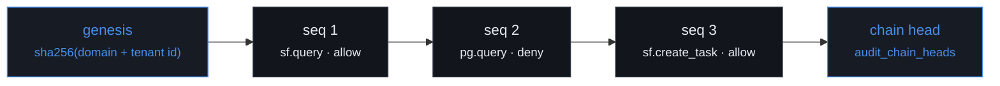

# Audit log

## The chain

Each row commits to the row before it:

```
row_hash = sha256( prev_hash || canonical_json(row without its hash columns) )
```



Change any field of row 2 and its hash changes, so row 3's `prev_hash` no longer matches. Fixing
row 3 breaks row 4. Rewriting one row means rewriting the entire tail, and the verifier reports the
exact row where recomputation first diverges.

## What is hashed

The covered fields are enumerated explicitly rather than spread from the row object:

```ts
// packages/audit/src/hash.ts
const value: CanonicalValue = {
  actor_token_jti: row.actorTokenJti,
  arguments_hash: row.argumentsHash,
  decision: row.decision,
  deny_reason: row.denyReason,
  id: row.id,
  latency_ms: row.latencyMs,
  mcp_server: row.mcpServer,
  tenant_id: row.tenantId,
  tool_name: row.toolName,
  trace_id: row.traceId,
  ts: row.ts.toISOString(),
  user_id: row.userId,
};
```

Adding a column should be a deliberate decision about whether the chain covers it, not something
that silently invalidates every existing hash.

## Canonical JSON

Two structurally identical rows must serialise byte-identically, or verification would fail on rows
nobody touched. `packages/shared/src/canonical.ts` implements an RFC 8785-style subset:

- object keys sorted by UTF-16 code unit
- `undefined` properties omitted; `undefined` array entries become `null`
- no insignificant whitespace
- non-finite numbers rejected — they are not representable in JSON
- `-0` normalised to `0`
- `Date` as ISO-8601, `bigint` as a decimal string
- circular structures rejected rather than silently truncated

Eighteen unit tests cover it, because a subtle bug here would make the whole chain unverifiable in a
way that only shows up months later.

## Per-tenant chains

Chains are per tenant, not global. A single chain would funnel every audit write in the system
through one lock; per-tenant chains let tenants append concurrently while keeping tamper-evidence
inside the boundary an auditor cares about.

The genesis hash is derived from the tenant id:

```ts
export function genesisHash(tenantId: string): string {
  return sha256Hex(`mcpgateway:audit:v1:genesis:${tenantId}`);
}
```

So a row cannot be lifted from one tenant's chain and spliced into another's — the recomputation
would diverge immediately. Asserted in `packages/audit/src/hash.test.ts`.

## Ordering under concurrency

Appending takes a row lock on the tenant's chain head inside the same transaction as the insert:

```sql
BEGIN;
  INSERT INTO audit_chain_heads (tenant_id, prev_hash, length)
  VALUES ($1, $genesis, 0) ON CONFLICT DO NOTHING;

  SELECT prev_hash FROM audit_chain_heads WHERE tenant_id = $1 FOR UPDATE;   -- serialises

  INSERT INTO audit_events (...) VALUES (...) RETURNING seq;

  UPDATE audit_chain_heads SET prev_hash = $row_hash, length = length + 1 WHERE tenant_id = $1;
COMMIT;
```

Without the lock, two replicas would read the same `prev_hash` and produce two rows claiming the
same predecessor — indistinguishable from tampering. The integration suite fires 200 concurrent
appends for one tenant and asserts the chain still verifies and the walk ends at the recorded head.

## Append-only, enforced

The hash chain makes tampering _detectable_. Privileges make the ordinary case — a bug, a careless
migration, a compromised gateway process — structurally impossible.

The gateway opens a second connection pool on a dedicated role:

```sql
GRANT INSERT ON TABLE audit_events TO mcpgw_audit;
GRANT USAGE, SELECT ON SEQUENCE audit_events_seq_seq TO mcpgw_audit;

-- INSERT ... RETURNING is treated as a read by Postgres, so the writer needs
-- SELECT on exactly the column it returns. Granting it on the whole table
-- would let the audit role read every tenant's history.
GRANT SELECT (seq) ON TABLE audit_events TO mcpgw_audit;

-- Read-write, because a new row has to be linked to the previous one. It holds
-- one hash per tenant and no event data: rewriting it cannot forge history, it
-- can only make verification fail loudly.
GRANT SELECT, INSERT, UPDATE ON TABLE audit_chain_heads TO mcpgw_audit;
```

There is no `UPDATE` or `DELETE` on `audit_events` for any application role.

Owners bypass grants, so a trigger covers the case grants cannot:

```sql
CREATE TRIGGER audit_events_no_update
  BEFORE UPDATE OR DELETE ON audit_events
  FOR EACH ROW EXECUTE FUNCTION audit_events_reject_mutation();
```

All of it is asserted in `tests/integration/audit.test.ts`: `UPDATE`, `DELETE` and `TRUNCATE` from
the audit role are refused, `UPDATE` and `DELETE` from the table owner are refused by the trigger,
and `INSERT` still works.

## Arguments are hashed, not stored

Tool arguments routinely carry customer data — a SOQL query naming a contact, a SQL predicate with
an email address. The chain only needs a digest to prove the call was not altered:

```ts
argumentsHash: sha256Canonical(input.arguments);
```

A tenant that needs full payloads for its own compliance reasons opts in per row or per tenant, and
they land in `audit_payloads`, which is deliberately **not** part of the chain. Retention and
deletion of payloads is then a separate policy decision from the integrity of the log.

## Detecting deletion from the tail

Removing the last few rows leaves a prefix that is internally consistent — every surviving row still
links correctly to its predecessor. Per-row hashes alone cannot see it.

The verifier compares the hash it arrives at after the walk against the recorded chain head:

```ts
const truncated = firstBreak === null && recordedHeadHash !== null && recordedHeadHash !== expected;
```

A valid walk that ends somewhere other than the head means rows were removed. Asserted in the
integration suite.

## Verifying

```bash
pnpm verify:audit                        # every tenant
pnpm verify:audit --tenant acme-corp     # one
pnpm verify:audit --json                 # machine-readable
pnpm verify:audit --corrupt-row 42       # alter, detect, restore
```

Rows are read in batches ordered by `seq` rather than loaded at once, so verification is bounded in
memory and can run against a log with millions of rows.

```
Audit chain verification

  acme-corp      VALID  1354 rows  677.2ms
  globex         VALID  1369 rows  290.9ms
  initech        VALID  1368 rows  186.8ms

  All chains verified (4091 rows)
```

The console has the same thing behind a **Verify chain** button on the audit page, which reports
rows checked and elapsed time, or the first break with both hashes.

## The tamper demonstration

```bash
pnpm verify:audit --corrupt-row 42
```

```
Tamper detection check

  Target   row seq 42 (bbf72ca8-9779-461b-968b-28f1aaa81505) in tenant globex
  Before   VALID (1369 rows)

  Altering the row. This first has to disable the guard trigger, which
  requires ownership of the table — the gateway's own role cannot do it.

  After    BROKEN

  Detected:
      first break at seq 42
      row      bbf72ca8-9779-461b-968b-28f1aaa81505
      reason   row_hash_mismatch
      expected 4edf446e59ff54b203de0c9afcb85366297a79ef0b35f16d51fd6b8c4b72119e
      actual   20f57f37cff0d31433c6832ba2681cb59ac33643996c8ae2c89e81c7935cac71

  One field changed by one millisecond, and the chain no longer verifies.

  Restored VALID
```

Note what the script has to do to succeed: disable the guard trigger, which requires table
ownership. The application role cannot reach that code path at all.

## What the verifier catches

| Attack                                          | Detected as                                                              |
| ----------------------------------------------- | ------------------------------------------------------------------------ |
| A field altered in place                        | `row_hash_mismatch` at that row                                          |
| A row deleted from the middle                   | `prev_hash_mismatch` at the following row                                |
| Rows reordered                                  | `prev_hash_mismatch`                                                     |
| A row inserted from another tenant              | `prev_hash_mismatch`                                                     |
| A row rewritten _with_ a recomputed hash        | `prev_hash_mismatch` at the next row, which still points at the old hash |
| Rows deleted from the tail                      | walk terminus does not match the recorded head                           |
| The whole log replaced from a different genesis | `prev_hash_mismatch` at row 1                                            |

The one thing a chain cannot survive is an attacker with table ownership _and_ enough time to
rewrite the entire tail _and_ the ability to update the chain head consistently. The defence against
that is the grant model above plus, in a real deployment, shipping the head to somewhere the
database role cannot reach — see SECURITY.md.

## Performance

The append is synchronous with the request. An asynchronous queue would take a few milliseconds off
the response and would also mean the log can silently lose its most interesting rows under stress,
which is when they matter most.

The cost is one indexed insert plus a per-tenant row lock. Because the lock is per tenant, tenants
never contend with each other, and a single tenant's audit throughput is bounded by how fast
Postgres can serialise its own chain. `pnpm bench` measures the whole path including this.

If one tenant ever outgrew a single chain, the next step is sharded chains within a tenant (one per
day, or per hash bucket of the user id) with a periodic roll-up — not abandoning the property.
