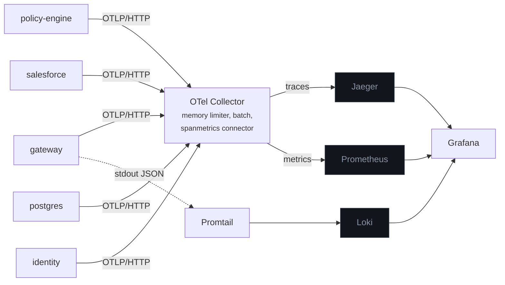

# Observability

## Shape



Every service exports over OTLP/HTTP to a collector rather than talking to backends directly, so
changing where traces go is a collector config change and not a redeploy of five services.

## Tracing

One trace spans the whole request:

```
gateway  POST /v1/servers/:server/tools/:tool          [gateway]
├── token exchange  mcp:policy-engine                  [gateway]
├── mcp.call  policy.evaluate                          [gateway]
│   └── mcp.tool  policy.evaluate                      [mcp-policy-engine]
├── token exchange  mcp:salesforce                     [gateway]
├── mcp.call  sf.list_opportunities                    [gateway]
│   └── mcp.tool  sf.list_opportunities                [mcp-salesforce]
└── audit append                                       [gateway]
```

For a warehouse call the leaf is a real `pg` span from the instrumentation, so the SQL that ran is
part of the trace.

**Propagation** is W3C `traceparent`, injected explicitly on the outbound MCP call rather than
relying only on auto-instrumentation:

```ts
const headers = injectTraceHeaders({ authorization: `Bearer ${call.accessToken}` });
```

Doing it explicitly means propagation still holds if the SDK is disabled, and it makes the mechanism
visible at the call site instead of implied.

**Attributes** this project sets on its own spans, all under `mcpgw.*`:

| Attribute                                   | Example                                       |
| ------------------------------------------- | --------------------------------------------- |
| `mcpgw.tenant.id`                           | `acme-corp`                                   |
| `mcpgw.user.id`                             | `usr_alice`                                   |
| `mcpgw.user.role`                           | `analyst`                                     |
| `mcpgw.mcp.server` / `mcpgw.mcp.tool`       | `salesforce` / `sf.query`                     |
| `mcpgw.decision` / `mcpgw.deny.reason`      | `deny` / `policy:deny-pii-on-restricted-plan` |
| `mcpgw.policy.rule`                         | `deny-pii-on-restricted-plan`                 |
| `mcpgw.token_exchange.cached` / `.audience` | `false` / `mcp:salesforce`                    |
| `mcpgw.rate_limit.remaining` / `.scope`     | `41` / `user:usr_alice/tool:sf.query`         |
| `mcpgw.audit.seq`                           | `10432`                                       |

Which means a question like "show me every denied call for this tenant in the last hour, and what
denied them" is a Jaeger tag search rather than a log grep.

**Health probes are excluded.** They are the majority of traffic in a Kubernetes deployment and
carry no information.

## Metrics

Two sources, deliberately.

**Application instruments**, for the things only the application knows:

| Instrument                                 | What it answers                        |
| ------------------------------------------ | -------------------------------------- |
| `mcpgw.tool.invocations`                   | call volume by tenant, tool, decision  |
| `mcpgw.tool.duration`                      | end-to-end latency at the gateway      |
| `mcpgw.token_exchange.duration` / `.total` | mirroring cost, and the cache hit rate |
| `mcpgw.policy.decisions` / `.duration`     | which rules fire, and how often        |
| `mcpgw.rate_limit.decisions` / `.duration` | throttling by scope and tier           |
| `mcpgw.audit.writes`                       | append success and failure             |
| `mcpgw.upstream.duration`                  | time in the target MCP server          |

Latency histograms use **explicit bucket boundaries** chosen around the shapes this system actually
produces:

```ts
advice: {
  explicitBucketBoundaries: [1, 5, 10, 25, 50, 100, 200, 400, 800, 1600, 3200];
}
```

A cached token exchange is sub-millisecond, an uncached one is a network round trip, and a warehouse
query can reach the hundreds of milliseconds. Default exponential buckets put almost every sample in
one bucket and make the p99 useless.

**A spanmetrics connector** in the collector derives RED metrics straight from spans, dimensioned by
tenant, server, tool and decision. That gives request rate, error rate and duration for every span
in the system without a single manual counter, and it stays correct when a new tool is added.

## Logs

pino to stdout, one JSON object per line, with the active trace and span ids injected by a mixin:

```json
{
  "level": "info",
  "time": "2026-03-14T09:12:44.031Z",
  "service": "gateway",
  "trace_id": "4bf92f3577b34da6a3ce929d0e0e4736",
  "span_id": "00f067aa0ba902b7",
  "requestId": "0f3e...",
  "method": "POST",
  "url": "/v1/servers/salesforce/tools/sf.query",
  "status": 200,
  "durationMs": 34.18,
  "subject": "usr_alice",
  "tenant": "acme-corp",
  "msg": "request completed"
}
```

**Secrets are redacted by path**, not by convention:

```ts
redact: {
  paths: [
    'req.headers.authorization', 'req.headers.cookie',
    '*.access_token', '*.refresh_token', '*.client_secret',
    'password', 'token',
  ],
  censor: '[redacted]',
}
```

A stray `logger.info({ headers })` cannot leak a bearer token.

Promtail collects container stdout, parses the JSON, promotes `level` to a label and `trace_id` to
structured metadata. Grafana's Loki datasource turns that into a click-through to the trace.

## Correlation, both directions

Provisioned in `infra/grafana/provisioning/datasources/datasources.yaml`:

- **Logs → traces.** A derived field on `trace_id` links each log line to Jaeger.
- **Traces → logs.** `tracesToLogsV2` filters Loki by trace id with a two-minute window either side.
- **Traces → metrics.** `tracesToMetrics` jumps from a span to the spanmetrics series for it.

So the path from "the console shows a denial" to "here is the trace" to "here are the log lines from
that request" to "here is the rate for this rule" is four clicks, no copy-pasting.

## Dashboards

Both are checked into `infra/grafana/dashboards/` and provisioned on startup.

**Gateway SLOs** — RED metrics: request rate by decision, error rate, p50/p95/p99 from the
spanmetrics histogram, rate-limit rejection rate, saturation.

**Permission mirroring** — token exchange latency split by cache outcome, cache hit rate, denials by
policy rule, denials per tenant. This is the dashboard that answers "is mirroring costing us
anything", which is the first question anyone asks about this design.

## Running it

`make demo` starts all of it. Then:

|                   |                                             |
| ----------------- | ------------------------------------------- |
| Traces            | <http://localhost:16686>                    |
| Dashboards        | <http://localhost:3001> — `admin` / `admin` |
| Metrics           | <http://localhost:9090>                     |
| Collector metrics | <http://localhost:8889/metrics>             |

To find a trace: make a call in the console, open the **Live requests** page, expand a row, and
click the trace id. Or from the audit page, the link icon on any row.

## Turning it off

Every service honours `OTEL_SDK_DISABLED=true`, which is how the test suites run — the integration
tests exercise the real code paths without needing a collector.

The SDK is started from a dedicated `instrumentation.ts` loaded via `node --import`, before the
application module is evaluated. Instrumentation that loads after the modules it patches silently
does nothing, and that failure is hard to notice.
